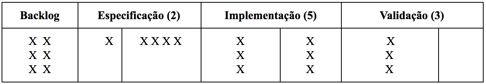
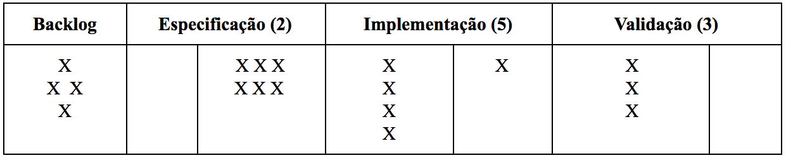
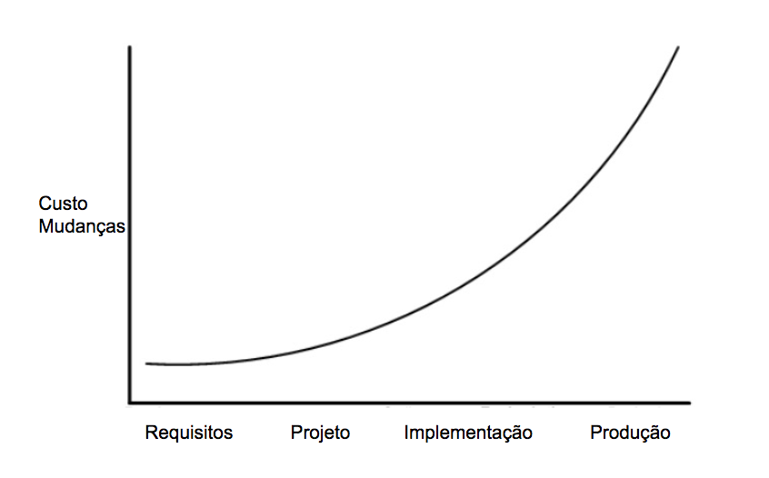

# Processos
## Exercícios de Fixação 🔗

1. Como XP preconiza que devem ser os contratos de desenvolvimento de software?
- Escopo aberto.

2. Quais as diferenças entre XP e Scrum?
- XP é um método exclusivo para o desenvolvimento de projetos de software. O Scrum é um método para desenvolvimento de projetos ágil sem exclusividade para um projeto de software.

3. Times Scrum são ditos cross-funcionais e auto-organizáveis. Por quê? Defina esses termos.
- cross-funcionais pois o grupo de trabalho deve ser multidisciplinar e auto-organizáveis, autonomia para decidir por quem as estórias serão implementadas.

4. Qual a diferença entre as histórias do "topo" e do "fundo" do Backlog do Produto, em Scrum?
- A priorização feita pelo Dono do Projeto, com isso estórias ao topo serão atendidas (inseridas na continuação do processo -> Backlog do Sprint) prioritariamente as do fundo.

5. O que são e para que servem story points?
- Estimativa a duração da estória (esforço).

6. Em Scrum, qual a diferença entre uma sprint review e uma retrospectiva?
- Sprint Review é a apresentação feita pelo time para os stakeholders e o próprio do que foi entregue do produto naquela Sprint. Retrospectiva reunião onde o time levanta melhorias para a próxima Sprint.

7. Um sprint pode ser cancelado? Se sim, por quem e por qual motivo? Para responder a essa questão, consulte antes o Scrum Guide [link](https://www.scrum.org/resources/scrum-guide), que é o guia que documenta a versão oficial de Scrum.
- Um Sprint pode ser cancelado se o Objetivo do Sprint se tornar obsoleto. Somente o Product Owner tem autoridade para cancelar o Sprint.

8. Procure pensar em um sistema de uma área da qual tenha algum conhecimento. (a) Escreva então uma história para esse sistema (veja que histórias são especificações resumidas de funcionalidades, com 2-3 sentenças). (b) Em seguida, quebre a história que definiu em algumas tarefas (de forma semelhante ao que fizemos no sistema similar ao Stack Overflow, usado como exemplo na seção sobre XP). (c) Existem dependências entre essas tarefas? Ou elas podem ser implementadas em qualquer ordem?

- _Um usuário, quando logado no sistema, deve ser capaz de consultar todos os seus cartões colecionáveis com a quantidade obtida para cada um deles._

| História - Consultar Cartões |
| --------------- |
| Criar nova rota para consultar de todos os cartões por usuário |
| Consultar informações de cartões armazenadas no banco de dados|
| Consultar Imagem de cada cartão em repositório externo|
| Criar os testes unitários |
| Documentar API de serviço com nova rota |
| Criar os testes BDD |

9. Suponha dois times, A e B, atuando em projetos diferentes, contratados por empresas distintas, sem conexões entre eles. Porém, ambos os times adotam sprints de 15 dias e ambos possuem 5 desenvolvedores. Nos seus projetos, o time A considera que sua velocidade é de 24 pontos. Já o time B assume uma velocidade de 16 pontos. Pode-se afirmar que A é 50% mais produtivo que B? Justifique sua resposta.
- Pode se afirmar que o time A tem uma velocidade 50% superior ao time B.

10. Quais são as principais diferenças entre Scrum e Kanban?
- O Kanban não tem as cerimônias obrigatórios do Scrum e também presa por ter o board fisicamente visível para todos.

11. Quais são as diferenças entre um Quadro Scrum e um Quadro Kanban?
O presa por ter o board fisicamente visível para todos diferente do Scrum e o Kanban introduz limitadores como WIP para a inserção de novos cards, o Scrum tem as etapas conforme a metodologia já o Kanban conforme a etapa que é realizado o produto.

12. Qual o erro existe no seguinte Quadro Kanban?
- Na coluna Especificação houve a quebra de tarefas para a estória 1 porém a mesma não saiu do quadro.

13. Suponha o seguinte quadro Kanban. Neste momento, o time não consegue trabalhar na especificação de novas histórias, pois o WIP do passo Especificação está sendo totalmente preenchido por itens esperando movimentação para o passo seguinte (Implementação). O que seria mais recomendado neste momento: (a) desrespeitar o WIP e já puxar uma nova história do Backlog para Especificação; ou (b) ajudar o time nas três tarefas em Validação, de forma a desbloquear o fluxo do processo.
- (b) ajudar o time nas três tarefas em Validação, de forma a desbloquear o fluxo do processo.
O Kanban presa por manter o WIP para ter uma equipe sustentável.

14. Por que se recomenda que os limites WIP calculados usando a Lei de Little sejam incrementados, por exemplo em 50%, de forma a admitir uma margem de erro? Em outros palavras, quais eventos podem originar esses erros na estimativa dos WIPs?
- Para acomodar variações no tamanho das tarefas, tarefas bloqueadas devido a fatores externos, etc

15. Descreva os principais recursos oferecidos por Waterfall, Scrum e Kanban para controlar riscos e garantir um fluxo de trabalho sustentável e que propicie o desenvolvimento de software com qualidade.
- Waterfall: Modelo em Espiral - Definição de objetivos e restrições e Avaliação de alternativas e análise de riscos.
- Scrum: Planejamento do Sprint, time decide o que entra na Sprint de acordo com sua velocidade.
- Kanban: Limites WIP, controle no board para puxar novas tarefas visando o desenvolvimento sustentável.

16. Seja um processo Kanban, dividido em quatro passos. A tabela a seguir informa o lead time de cada um deles e o throughout do passo C, que é o passo mais lento. Com base nesses valores, calcule o WIP de cada passo (última coluna da tabela).

| Passo | Lead Time (médio, dias) | Throughput (tarefas/dia) | WIP |
| --------------- | --------------- | --------------- | --------------- |
| A | 4 | - | 2 |
| B | 3 | - | 1.5 |
| C | 10 | 0.5 | 5 |
| D | 5 | - | 2.5 |

17. Veja o seguinte gráfico, que mostra — para um determinado sistema — como os custos de mudanças variam conforme a fase do desenvolvimento em que elas são realizadas. (a) Qual método de desenvolvimento você recomendaria para esse sistema? Justifique sua resposta. (b) Sistemas de quais domínios podem ter uma curva de custos de mudanças semelhante a essa?

(a) Kanban: Por ter as etapas bem definidas
(b) Sistemas legados

18. O artigo "Development and Deployment at Facebook" [link](https://research.fb.com/publications/development-and-deployment-at-facebook/) apresenta os métodos e práticas de desenvolvimento de software usados no Facebook. Na sua primeira seção (páginas 2-3; figura 2), os autores fazem uma distinção entre alguns métodos de desenvolvimento, baseando-se na frequência com que versões de um sistema são liberadas para uso quando se adota cada um deles. Complete a seguinte tabela informando a frequência de releases mencionada no artigo para alguns métodos e políticas de liberação de software.
 
| Método | Frequência de novas releases |
| --------------- | --------------- |
| Waterfall | uma vez |
| Evolucionário | meses |
| Ágil | semanas |
| Facebook | um dia |
| Deployment Contínuo | menos de uma hora |

19. Por que métodos como o Processo Unificado (UP) e Espiral não são considerados ágeis? E qual a diferença deles para o Modelo Waterfall?
- Elas possuem as práticas: ênfase em documentação e em uma fase inicial de levantamento de requisitos e depois de design.

Diferente das bases 'Software em funcionamento, mais do que documentação abrangente' e 'Indivíduos e interações, mais do que processos e ferramentas'
